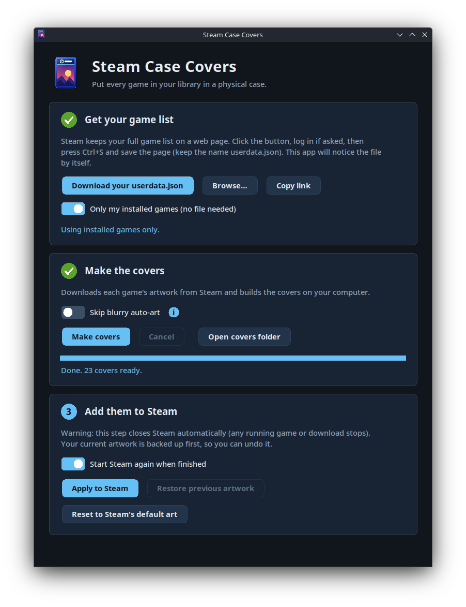

<p align="center">
  
</p>

<h1 align="center">steam-case-covers</h1>

<p align="center">
  Give every game in your Steam library a "physical copy" case cover.<br>
  Everything runs on your computer: no login, no API key, no uploads.
</p>

<p align="center">
  <a href="https://github.com/diegobergonsi/steam-case-covers/releases"><b>DOWNLOAD</b></a>
</p>

<p align="center">
  <a href="#install">Install</a> ·
  <a href="#how-it-works">How it works</a> ·
  <a href="#features">Features</a> ·
  <a href="#safety">Safety</a> ·
  <a href="#steam-compatibility">Steam compatibility</a> ·
  <a href="#command-line">Command line</a> ·
  <a href="#faq">FAQ</a>
</p>

<p align="center">
  
  <br>
  <em>The whole app: three steps, no terminal.</em>
</p>

<p align="center">
  <em>
    This project is not affiliated with Valve Corporation, Microsoft or any game publisher.
    Steam and Windows are trademarks of their respective owners. See <a href="THIRD_PARTY.md">THIRD_PARTY.md</a>.
  </em>
</p>

## What is it?

Steam shows your library as tall portrait cards. This tool puts each game's own artwork inside a blue "box" with a Steam banner and platform badges, like a boxed console game, and installs the result as your custom artwork.

The artwork comes from Steam's own servers. The covers are built on your computer and stay there.

## Install

<details>
<summary><b>Windows</b></summary>

Download `SteamCaseCovers-windows.exe` from the [Releases page](https://github.com/diegobergonsi/steam-case-covers/releases) and double-click it.

If "Windows protected your PC" appears, click **More info**, then **Run anyway**. The app isn't code-signed (that costs money), which is why Windows warns you. Some antivirus tools also flag apps of this kind.

</details>

<details>
<summary><b>macOS</b></summary>

Download `SteamCaseCovers-macos.zip` from the [Releases page](https://github.com/diegobergonsi/steam-case-covers/releases) and double-click it to unzip. **Before you open the app**, run this in **Terminal** (change the path if the app isn't in Downloads), then double-click the app:

```bash
xattr -dr com.apple.quarantine ~/Downloads/SteamCaseCovers.app
```

Why: macOS blocks any app that doesn't come from a paid Apple developer (about 99 USD a year, which a free project can't justify). That command removes the "downloaded from the internet" mark, so macOS opens the app normally. The app isn't harmful or damaged, and its source code is here for anyone to read.

If you open the app first instead, macOS shows **"SteamCaseCovers" Not Opened: Apple could not verify it is free of malware**. Click **Done** (not Move to Trash), then open **System Settings**, **Privacy & Security**, scroll to **Security**, and click **Open Anyway** next to the SteamCaseCovers message (it stays for about an hour; double-click the app again to bring it back). If the app then bounces in the Dock forever with no window, **restart your Mac** and use the Terminal command above instead. On macOS 14 or older you can also right-click the app and choose **Open**.

macOS support is **best effort**: the author has only tested it on an Apple Silicon MacBook Air. The build is for Apple Silicon (M1 or newer). On an Intel Mac, run it [from source](#from-source).

</details>

<details>
<summary><b>Linux and Steam Deck</b></summary>

Download `SteamCaseCovers-linux` from the [Releases page](https://github.com/diegobergonsi/steam-case-covers/releases), make it executable, and run it:

```bash
chmod +x SteamCaseCovers-linux
./SteamCaseCovers-linux
```

On a Steam Deck, switch to **Desktop Mode** first. The app needs a desktop window, so it doesn't run in Gaming Mode.

</details>

<details id="from-source">
<summary><b>From source (any system)</b></summary>

If you'd rather not trust a download, run it from the code. It needs Python 3.8+ and Pillow 10.3 or newer.

```bash
git clone https://github.com/diegobergonsi/steam-case-covers
cd steam-case-covers
python -m pip install -r requirements.txt
python gui.py
```

On macOS and Linux, use `python3` instead of `python`. Run the tests with `python -m unittest discover -s tests`.

</details>

Release files come with a `SHA256SUMS` list so you can check what you downloaded. See [SECURITY.md](SECURITY.md).

## How it works

1. **Get your game list.** Click **Download your userdata.json**. Your browser opens Steam: log in if it asks, and you'll land on a page of plain text. Save it (Ctrl+S, or Cmd+S on a Mac) as `userdata.json`. The app notices the file by itself. No browser opening? Click **Copy link** and paste it yourself. Or tick **Only my installed games** to skip this step. On a Mac with Safari, set the format to **Page Source** when saving (or use Chrome or Firefox).
2. **Make the covers.** Click **Make covers** and wait. You can cancel and run it again later: finished covers are kept, so it picks up where it stopped.
3. **Add them to Steam.** Click **Apply to Steam**.

> [!WARNING]
> Step 3 **closes Steam for you** (any running game stops and downloads pause), adds the covers, and starts Steam again. Save your game first. The app asks before it does anything.

Changed your mind?

* **Restore previous artwork** undoes the last Apply. Press it again to go one step further back.
* **Reset to Steam's default art** removes the covers this app made and leaves any art you set yourself alone. It works even if you have no backup. It's undone with Restore.

## Features

✅ Covers for your installed games, or your whole library <br>
✅ Each cover is the game's own portrait inside a case, with the Steam banner and platform badges <br>
✅ One click to install them: Steam is closed gracefully, backed up, updated and restarted <br>
✅ Undo, step by step, and a reset to Steam's default art <br>
✅ Cancel anytime; run again to continue <br>
✅ Optional "skip blurry auto-art" for games Steam has no real portrait for <br>
✅ Works with the keyboard, scales on high-DPI screens and fits small screens like the Steam Deck's <br>
✅ Free software: no ads, no account, no telemetry

## Safety

* It only ever touches the `<appid>p.png` files in your Steam account's `config/grid` folder. It never touches your games or saves.
* Before every change it makes a backup of exactly what it changes, writes files atomically, and rolls back if anything fails.
* Two open windows can't change Steam's folder at the same time.
* It never logs in, never asks for a password or API key, never uploads anything and never runs with elevated rights.
* Files it reads from the internet are size-limited and checked before use.

If you find a security problem, please [report it privately](SECURITY.md).

## Steam compatibility

✅ Linux and SteamOS (Steam in `~/.local/share/Steam`) <br>
🟡 Windows, macOS, Flatpak and Snap installs of Steam are found automatically, and the automated tests pass on Windows and macOS, but the author has only run the app itself on SteamOS so far

> [!NOTE]
> If something doesn't work on your system, please [open an issue](https://github.com/diegobergonsi/steam-case-covers/issues) with your system and what you saw. Feedback from Windows and macOS is especially welcome.

## Command line

Everything the window does is also available in a terminal:

```bash
python steamcase.py make --library userdata.json   # build covers
python steamcase.py apply --close-steam            # install them
python steamcase.py restore                        # undo the last apply
python steamcase.py reset                          # back to Steam's default art
```

| Command | What it does |
|---|---|
| `list` | Show the games it found |
| `make` | Build covers into `./covers` |
| `apply` | Copy covers into Steam, with a backup |
| `run` | `make` then `apply` |
| `restore` | Undo the last apply (run again to go further back) |
| `reset` | Remove the covers this app made from Steam |

Run `python steamcase.py -h` for all options, such as `--only`, `--skip-auto-art`, `--steam-dir` and `--user`.

## FAQ

<details>
<summary><b>It says my game list has no games in it</b></summary>

You weren't logged in to Steam in your browser when you saved the page. Steam doesn't show an error in that case; it gives an empty list. Click **Download your userdata.json** again: it opens Steam's login page first, so log in there, then save the page you land on. If that page shows no games even though you just logged in, refresh it (F5, or Cmd+R on a Mac) before saving.

</details>

<details>
<summary><b>Why do some covers look blurry?</b></summary>

Many older or smaller games have no real portrait on Steam. Steam builds a stand-in from the wide header image, so the title banner sits in the middle of a blurred copy of itself. Tick **Skip blurry auto-art** (hover the **i** next to it) to leave those games alone.

</details>

<details>
<summary><b>I set custom art by hand in Steam. Will these replace it?</b></summary>

Custom art set by hand in Steam's own menu can override these covers. If a game still shows its old art, reset it there (right-click the game, **Manage**, **Set custom artwork**).

</details>

<details>
<summary><b>Where are the covers stored?</b></summary>

In your own user folder: `~/.local/share/steamcase/covers` on Linux, `%LOCALAPPDATA%\steamcase\covers` on Windows and `~/Library/Application Support/steamcase/covers` on macOS. Use **Open covers folder** in the app. Steam's copies live in `userdata/<id>/config/grid`; copy that folder to use the covers on another computer.

</details>

<details>
<summary><b>Does it work for non-Steam games and shortcuts?</b></summary>

Not yet. Only games in your Steam library.

</details>

<details>
<summary><b>Can I get the covers without running it?</b></summary>

Covers I already made are on SteamGridDB: <https://www.steamgriddb.com/profile/76561198040695197/grids/1>.

</details>

<details>
<summary><b>Are screen readers supported?</b></summary>

No. The window works fully with the keyboard (Tab, Space, Enter), but the toolkit it uses can't talk to screen readers. The command line is the accessible alternative.

</details>

## Acknowledgments

Thanks to [SteamGridDB](https://www.steamgriddb.com) and its community for making custom Steam artwork easy to share, and to the authors of [Pillow](https://python-pillow.org), [PyInstaller](https://pyinstaller.org), the [Nunito Sans](https://fonts.google.com/specimen/Nunito+Sans) font and the KDE Breeze icon theme. Details are in [THIRD_PARTY.md](THIRD_PARTY.md).

Game artwork shown above belongs to its publishers and developers. Covers you generate contain that artwork: keep them for personal use.

## License

Copyright (C) 2026 Diego Bergonsi. Free software under the [GNU General Public License v3 or later](LICENSE): you may use, change and share it, and anything you distribute built on it must stay open under the same license.
