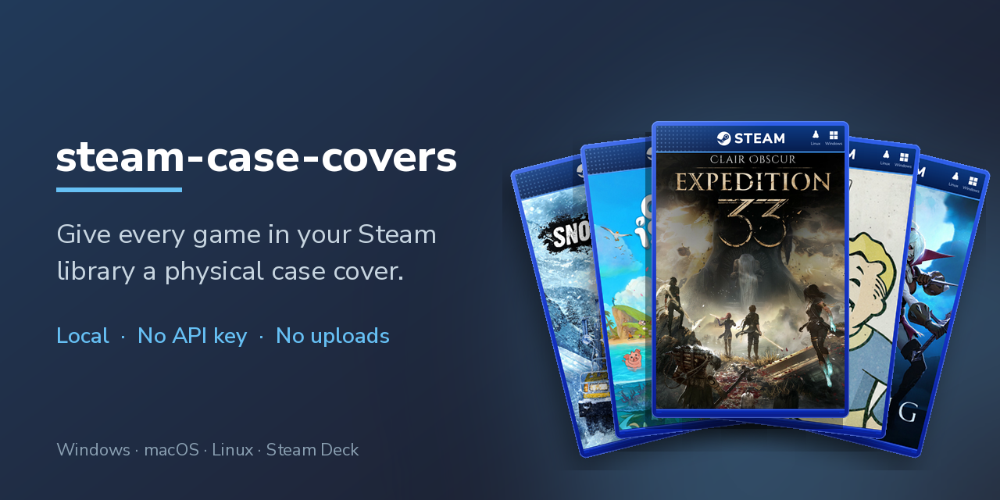

# steam-case-covers

Gives every game in your Steam library a "physical copy" cover: the game's art inside a blue case with a Steam banner.

Everything runs on your computer. No login, no API key, no uploads. The art comes from Steam's own servers.

Not affiliated with Valve, Microsoft or any publisher. See [THIRD_PARTY.md](THIRD_PARTY.md).

Covers I already made are on SteamGridDB: <https://www.steamgriddb.com/profile/76561198040695197/grids/1>. You can download them from there instead of generating your own.

## Get the app

Download the file for your system from the [Releases page](https://github.com/diegobergonsi/steam-case-covers/releases):

| System | File | First run |
|---|---|---|
| Windows | `SteamCaseCovers-windows.exe` | If "Windows protected your PC" appears: **More info**, then **Run anyway** |
| macOS | `SteamCaseCovers-macos.zip` | Unzip, then right-click the app and choose **Open** |
| Linux | `SteamCaseCovers-linux` | Make it executable (`chmod +x`), then run it |

The app isn't code-signed (that costs money), which is why Windows and macOS warn you. Some antivirus tools also flag apps of this kind. If you'd rather not trust a download, run it from source (below).

## Use it

1. **Get your game list.** Click "Download your userdata.json", log in to Steam if asked, then press Ctrl+S and save the page. The app notices the file by itself. No browser opening? Click "Copy link" and paste it yourself. Or tick "Only my installed games" to skip this.
2. **Make the covers.** Click "Make covers" and wait. You can cancel and run it again later: finished covers are kept, so it picks up where it stopped.
3. **Add them to Steam.** Click "Apply to Steam". **It closes Steam for you**, backs up your current artwork, adds the covers and starts Steam again.

Changed your mind? "Restore previous artwork" undoes the last Apply. Press it again to go one step further back. Each Apply keeps a backup of only what it changed.

Want Steam's own art back, with or without a backup? "Reset to Steam's default art" removes the covers this app made (it recognises them by their frame) and leaves any art you set yourself alone. It is undone the same way, with "Restore previous artwork".

## From source

Needs Python 3.8+ and Pillow 10.3 or newer.

```bash
python -m pip install -r requirements.txt
python gui.py                     # the window
python steamcase.py -h            # or the command line
```

Tests: `python -m unittest discover -s tests`.

Command line, step by step: `python steamcase.py make --library userdata.json`, then `python steamcase.py apply --close-steam`. Undo with `python steamcase.py restore`, or go back to Steam's default art with `python steamcase.py reset`.

## Notes

- Many old games have no real portrait on Steam, so their covers look blurry. Tick "Skip blurry auto-art" (hover the **i** next to it) to leave those alone.
- Custom art you set by hand in Steam overrides these covers.
- Covers are local to the computer. Copy Steam's `userdata/<id>/config/grid` folder to use them elsewhere.
- Run it in desktop mode on a Steam Deck.
- The window works with the keyboard (Tab, Space, Enter), but screen readers aren't supported by the toolkit it uses.
- Tested on Linux (SteamOS). Windows and macOS should work, but please open an issue if something breaks.
- Covers contain publishers' art. Keep them for personal use.

Copyright (C) 2026 Diego Bergonsi. Free software under the [GNU General Public License v3 or later](LICENSE): you may use, change and share it, and anything you distribute built on it must stay open under the same license. Third-party files and trademarks: [THIRD_PARTY.md](THIRD_PARTY.md).
